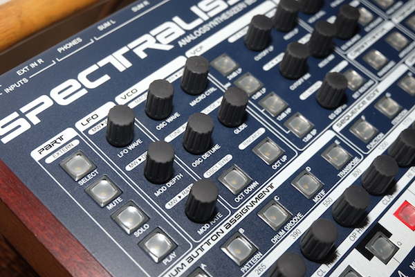

# raditecSPT

This is an attempt to document the Spectralis SPT data format. 

## What has been documented so far?
- SPT appears to use several different data structures.
- <a href="SPT_types.h">SPT_types.h</a> defines some known data structures.
- Other files in the repository provide C functions for reading, parsing, and writing SPT data.

## Why are you doing this?
Spectralis OS v1.04k provides two isolated sequencers with different feature sets.  I want to

- exchange data between the two sequencers to freely take advantage of probability, skip, mute, roll, motif swap, creativator features, etc for any musical sequence
- import and export data to SMF MIDI file format

A typical workflow might involve
- import a rhythm from an SMF MIDI file into SPT on drum parts
- load into the spectralis and edit using the step buttons
- move drum sequence data to the step-sequencer to apply mute/skip/probability
- record MIDI output from the spectralis to an external sequencer
- export a section as an SMF MIDI file
- import this rhythm into a second SPT on drum parts
- load into the spectralis and...

We're a little way off that goal right now sadly. **Can you help?**

## What is the Spectralis?
The Radikal Technologies Spectralis is a "performance-oriented music instrument with multiple sequencer-sections [and] sampling engine [...] A pattern-based 17-track sequencer [for drums and] 32 track analog-style step-sequencer which not only plays notes, but can modulate most of the soundparameters of the Spectralis."
